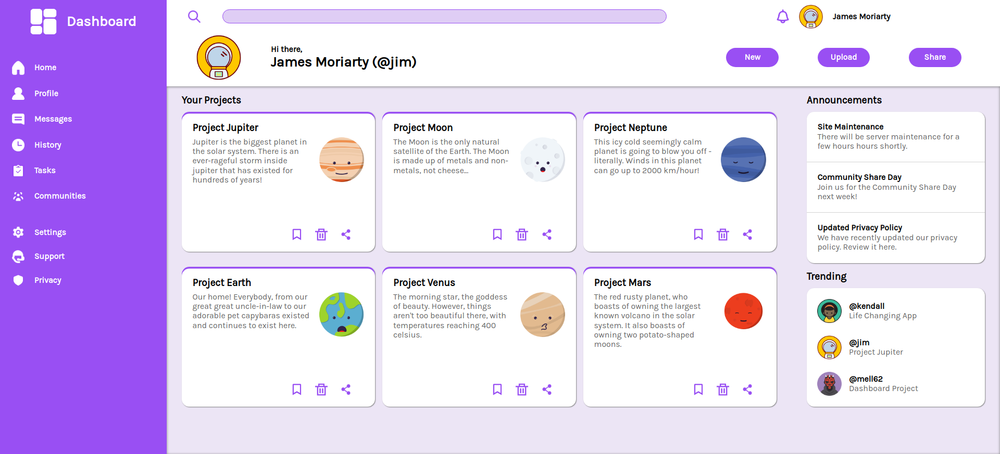

# Admin dashboard

A complete dashboard webpage, built purely from vanilla HTML and CSS, utilizing the power of CSS Grid.

**Check it out :point_right:[here](https://mell62.github.io/admin-dashboard):point_left:!**

## :star2: Achievements

- **CSS Grid** is majorly used to implement the layout
- CSS Flexbox is paired with Grid to achieve easier control of the layout
- Responsive in all screen sizes, including mobile devices

## :page_with_curl: Note

- Normalize.css is used to maintain cross-browser consistency
